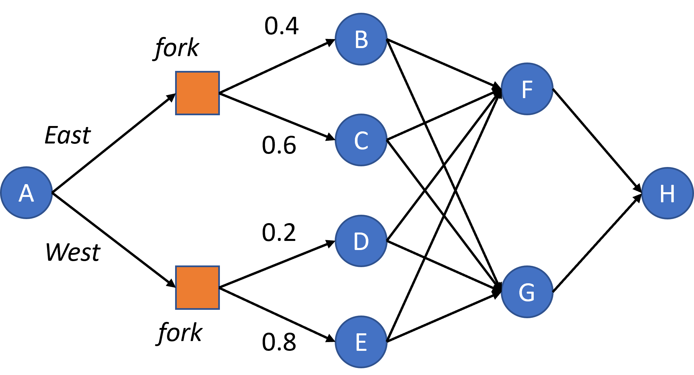

# Stochastic Dynamic Programming

## Overview

This repository contains practical assignments and implementations related to Stochastic Dynamic Programming (SDP), focusing on various problems including the stochastic shortest path (SPP), stochastic transition problem, and parking problem. The primary objective is to apply dynamic programming techniques to optimize decisions in stochastic environments.


## Key Concepts

### Part A: Stochastic Shortest Path

Tom plans a journey from City "A" to City "H" with potential overnight stays in intermediate cities. Given random energy costs due to factors like weather and traffic, the goal is to determine the optimal path to minimize expected energy expenditure. 

#### Tasks

1. **Intuitive Path Analysis:** Determine the optimal path based on cost inspection.
2. **Algorithm Implementation:** Complete and run the stochastic dynamic programming algorithm to find the optimal path.
3. **Validation:** Compare the algorithm's result with initial intuition and results from previous practicals.
4. **Sensitivity Analysis:** Modify probabilities and costs to evaluate the impact on the optimal path and cost.

### Part B: Stochastic Transition Problem

Analyze a scenario where Tom encounters a fork in the road with potential path blockages. The goal is to compute the optimal action at each decision point, considering the probabilistic nature of path obstructions.



#### Tasks

1. **Algorithm Completion:** Implement the stochastic dynamic programming algorithm to determine the optimal actions and associated costs.

### Part C: Parking Problem

Optimize parking decisions for a driver considering various parking scenarios with different cost functions and probabilities. The goal is to minimize the total cost, including the cost of parking at a terminal location if no free spots are found.

#### Tasks

1. **Scenario Analysis:** Evaluate the best stopping point based on the cost functions and probabilities provided.

## Code Structure

```markdown
stochastic-dynamic-programming/
│
├── README.md                                        # overview and instructions
├── Practical__Stochastic_Dynamic_Programming.ipynb  # Contains Jupyter Notebook with code implementations and analyses for the practical exercises.
├── graph.png                                        # Graphical representation of the Transition Problem
                    
```

## Usage

1. Clone the repository:
    ```bash
    git clone https://github.com/Mahmood-Anaam/stochastic-dynamic-programming.git
    ```
2. Navigate to the directory:
    ```bash
    cd stochastic-dynamic-programming
    ```
3. Open the Jupyter Notebook:
    ```bash
    jupyter notebook Practical__Stochastic_Dynamic_Programming.ipynb
    ```
4. Follow the instructions within the notebook to complete the assignments.
